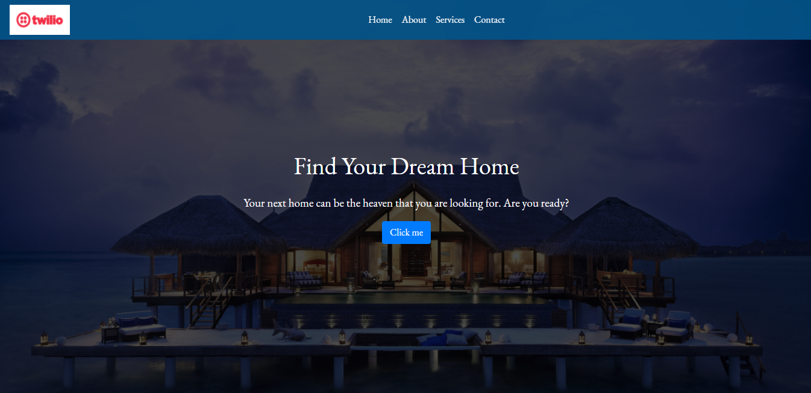
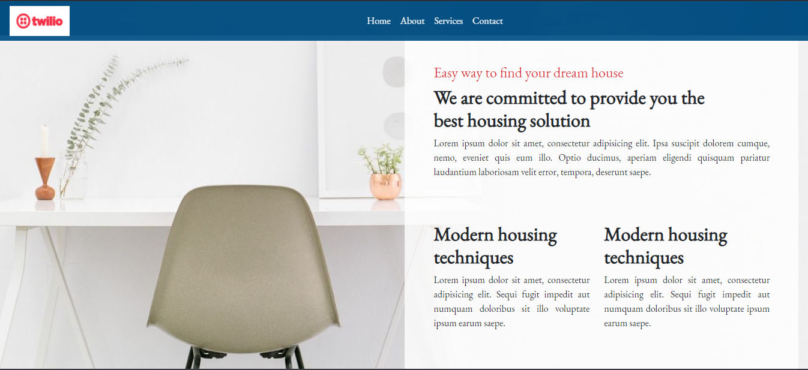

# Global Home

> This is a single page website for real estate company. React Js framework was used to build this website. All the section of this page are individual component. Only functional react components were used as it is a static webpage. Babel, Webpack, bootstrap, Fontawesome node modules were used to make the website functional.






## Live Demo

[globalhome](https://ajkacca457.github.io/global_home_static_react/)

## Built With

- Html
- Css
- Vanila Js
- Atom text editor
- React Js
- Npm

# Getting Started

To get a local copy of the repository please run the following commands on your terminal:

```
$ cd <folder>
```

```bash

$ git clone `https://github.com/ajkacca457/global_home_static_react.git`
$ cd global_home_static_react
$ Run `npm install` to install the necessary modules

```

# Authors

👤 **Avijit Karmaker**

- Github: [@Avijit](https://github.com/ajkacca457)
- Linkedin: [@Avijit](https://www.linkedin.com/in/avijit-karmaker-8738a54)

## 🤝 Contributing

Contributions, issues and feature requests are welcome!

## Show your support

Give a ⭐️ if you like this project!

## Copyright
This is a project developed by Avijit.
